```mermaid
graph TD
    A[Client] --> B[Next.js API Routes]
    B --> C[AI Services]
    C --> D[Video Generation]
    D --> E[Firebase Storage]
    B --> F[Neon DB]
    B --> G[Authentication]
    
    style A fill:#93C5FD,stroke:#4F46E5
    style B fill:#818CF8,stroke:#4F46E5
    style C fill:#6366F1,stroke:#4F46E5
    style D fill:#4F46E5,stroke:#4F46E5
    style E fill:#3730A3,stroke:#4F46E5
    style F fill:#312E81,stroke:#4F46E5
    style G fill:#1E1B4B,stroke:#4F46E5
```
  
# [AutoClip AI](https://autoclip.vercel.app) 🎬

#### Transform Text into Cinema-Quality Videos with AI Magic ✨

[Demo](https://autoclip.vercel.app) · [Features](#-key-features) · [Tech Stack](#%EF%B8%8F-tech-stack) · [Architecture](#-architecture)

## 🎯 Overview

AutoClip AI is a revolutionary SaaS platform that harnesses the power of multiple AI services to transform text into professional, engaging videos. Built with enterprise-grade technology and designed for scalability.

   
  
   

## ✨ Key Features

<table>
<tr>
<td>
  
### 🎨 AI-Powered Creation
- Text-to-video transformation
- Professional script generation
- Dynamic scene composition
- Real-time rendering

</td>
<td>

### 🔊 Audio Excellence
- Google Cloud TTS integration
- Multilingual support
- Professional voiceovers
- Dynamic audio mixing

</td>
</tr>
<tr>
<td>

### 🎬 Video Magic
- Remora Video engine
- Custom style presets
- Scene transitions
- HD export quality

</td>
<td>

### 🤖 AI Intelligence
- Gemini AI integration
- Smart scene generation
- Content optimization
- Contextual enhancement

</td>
</tr>
</table>

## 🛠️ Tech Stack

### Core Technologies

### Database & ORM

### AI & Services

### Authentication & Storage

## 📐 Architecture

## 🚀 Getting Started
# Clone the repository
git clone https://github.com/Onyerikam/autoclip-ai.git

# Install dependencies
bun add all

# Configure environment variables
cp .env.example .env.local

# Start the development server
bun run dev

## 📈 Performance Metrics

  <table>
    <tr>
      <td align="center">
        <h3>100</h3>
        
Performance

        

      </td>
      <td align="center">
        <h3>100</h3>
        
Accessibility

        

      </td>
      <td align="center">
        <h3>100</h3>
        
Best Practices

        

      </td>
      <td align="center">
        <h3>100</h3>
        
SEO

        

      </td>
    </tr>
  </table>

## 🎯 Roadmap

<table>
<tr>
<td>

### Completed ✅
- [x] Core video generation engine
- [x] AI-powered script generation
- [x] Custom style presets

</td>
<td>

### Coming Soon 🚀
- [ ] Collaborative team workspaces
- [ ] API access
- [ ] Enterprise features

</td>
</tr>
</table>

## 💝 Credits

Built with passion by [Onyerikam](https://github.com/Onyerikam) and powered by:

| Technology | Purpose |
|------------|---------|
| [Remora Video](https://remora.com) | Video Generation Engine |
| [Google Cloud TTS](https://cloud.google.com/text-to-speech) | Text to Speech |
| [Gemini AI](https://deepmind.google/technologies/gemini/) | AI Intelligence |
| [shadcn/ui](https://ui.shadcn.com) | UI Components |
| [Neon DB](https://neon.tech) | Database |
| [Vercel](https://vercel.com) | Deployment |

## 📄 License

This project is licensed under the [MIT License](LICENSE) - see the LICENSE file for details.

---

**© 2024 [Onyerikam](https://github.com/Onyerikam). All Rights Reserved.**

